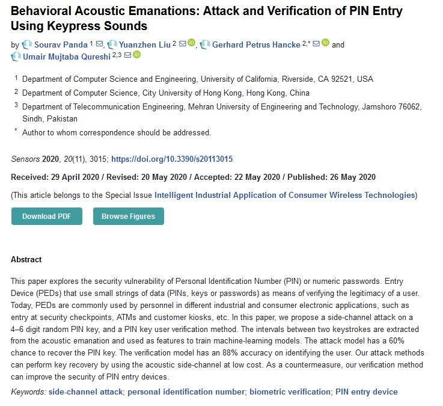

# Deep-Tech Web Security

**Gun Gun Febrianza**

Event Dadakan 7 January 2021

------------

## 

# Web Browser

Berbicara tentang Web Security, bisa dimulai dari aplikasi browser. Sebuah pintu tempat customer kita berinteraksi dengan aplikasi yang kita ciptakan. Tugas dari aplikasi browser adalah melakukan rendering halaman web agar dapat dimengerti oleh manusia.

  

# HTTP

# HTTP Headers

# HTTP Cookies

# Your Security State

# Threats

# DDoS Attack

# Bug Bounty

# Web Security

**Web Security** adalah salah **branch** dalam ilmu keamanan komputer. **Web Security** fokus mengkaji keamanan suatu **Web Application** mulai dari **front-end** hingga ke **back-end**. Kajian keamanan komputer merupakan area yang kompleks karena masing-masing **branch** menjadi **integral part** untuk yang satu dan lainnya.

Sekup pembahasan **Web Security** sering kali meluas dengan area Ilmu Keamanan komputer yang lain seperti **Operating System Security**, **Application Server Security**, **Pentesting**, **Social Engineering** dan hingga ke yang paling kompleks dan keren menggunakan **Artificial Intelligence**. 

Misal pada paper penelitian di bawah ini, penerapan **Machine Learning** sebagai salah satu cabang **Artificial Intelligence** untuk membaca PIN yang kita typing (misal) melalui ATM (Mesin Transaksi Keuangan). Metode yang digunakannya adalah **Acoustic Emanations** dengan tingkat akurasi untuk **recover** **PIN** mencapai 60%!

# Website Defacement

Dalam Jurnal yang ditulis Marco dan Nik yang berjudul ***"Hacktivism dan Website Defacement : Motivation, Capabilities and Potential Threat."***, dikatakan bahwa **Hacktivism** dan Website Defacement seringkali memiliki keterkaitan. 

**Website Defacement** adalah serangan yang ditujukan untuk mengubah tampilan suatu **website**. Seorang **Defacer** berhasil melakukan **privilege escalation** menembus **server**, mengubah tampilan halaman depan (**index**) pada **Web Server**.

## Web Shell

**Web Shell** sering kali disebut dengan **Web Server Malware**, sebuah **malicious script** yang digunakan **attacker** agar **attacker** memiliki kontrol terhadap suatu **Remote Server**. Setiap **Web Shell** memiliki **payload** yang dapat digunakan **attacker** untuk melakukan **shell command execution**, **code execution**, **database enumeration**, dan **file management**.

**Web Shell** dapat ditulis menggunakan berbagai bahasa pemrograman, PHP paling menonjol karena banyak sekali penggunanya baik dari sisi pengembang **Web Application** ataupun **Attacker**. 

Potensi kerusakan dapat menimpa anda apapun **runtime engine** untuk **Web Server** yang anda gunakan, atau **Content Management System (CMS)** yang anda gunakan. Jika anda pengguna **CMS Wordpress**, kerentanan sistem dapat terjadi di sisi **CMS** itu sendiri atau melalui **plugins** yang anda gunakan.

**In Early Development**, mostly anti viruses tidak bisa mendeteksi **Web Shell** sebagai **Virus** karena **Web** **Shell** bukan **file executable**, **nowadays anti viruses** sudah memiliki kemampuan **heuristic** yang lebih **advance**. Seperti **Static Code Analysis** untuk mendeteksi **Web Shell**.

